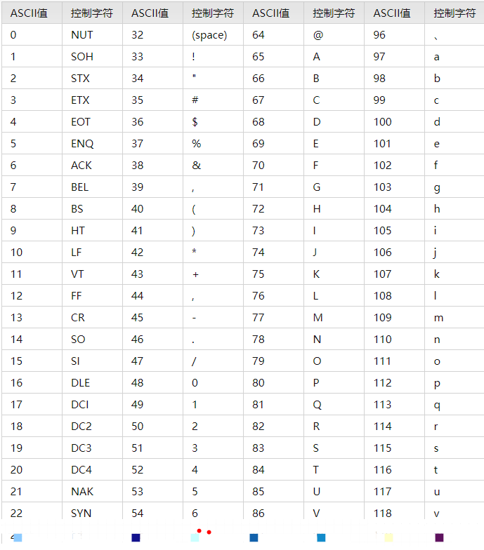
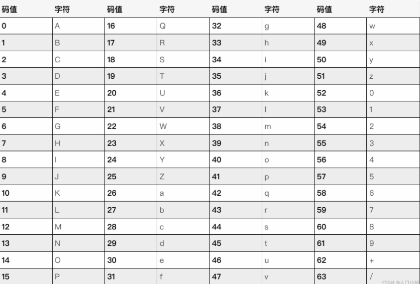

+++
title = "ascii转base64"
description = "ascii码有很多不可见字符，不方便正确的传输，需要转化成可见字符,转化规则如下"
date = 2021-12-16T12:01:51+08:00
featured = false
comment = true
toc = true
reward = true
categories = [
  "编码"
]
tags = [
  "base64",
  "ascii",
]
series = [
  "原理"
]
images = []
+++

ascii 转 base64 的规则

<!--more-->

When you have some binary data that you want to ship across a network, you generally don't do it by just streaming the bits and bytes over the wire in a raw format. Why? because some media are made for streaming text. You never know -- some protocols may interpret your binary data as control characters (like a modem), or your binary data could be screwed up because the underlying protocol might think that you've entered a special character combination (like how FTP translates line endings). So to get around this, people encode the binary data into characters. Base64 is one of these types of encodings. Why 64? Because you can generally rely on the same 64 characters being present in many character sets, and you can be reasonably confident that your data's going to end up on the other side of the wire uncorrupted

标准 ASCII 码，使用 7 位二进制数 2（2^7=128,剩下的 1 位二进制为 0）来表示所有的大写和小写字母，数字 0 到 9、标点符号，以及在美式英语中使用的特殊控制字符，码表如下

base64 使用大写和小写字母，数字 0 到 9，+ /共 64 个字符编码，码表如下

那么怎么将 ascii 字符'ab',转化为 base64 码，规则是怎么样的呢？

我们在 ascii 码表分别找到 a，b 的码值为 97,98，用 2 进制表示为 1100001，1100010(可以使用方法 97..toString(2)得到)，不足 8 位的在前面补 0，那么‘ab’二进制表示就是 01100001 01100010

base64 只有 64 个字符，只需要 6（2^6=64）位就可以容纳，那么我们可以分割成 011000 010110 0010，① 后面不足 6 位在后面补 0，于是就成为了 011000 010110 001000，我们得出他们的 10 进制分别为 24,22,8（可以使用 parseInt(11000,2)计算出）

通过比对 base64 码，我们分别找到 24,22,8 对应的字符为 Y,W,I

根据规定转化后的长度需要是 4 的倍数，② 不足部分在后面加‘=’，于是变成了 YWI=,我们通过 btoa('ab')方法验证，结果正确

ab 字符实际有效占用的空间是 2*7=14 位（标准的 ascii 只有 7 位有效的)，转化为 base64 后，4*8=32 位（这里加了个=，多了 8 位），因此 base64 编码后会增加传输量，具体增加多少取决于 ① ② 处
