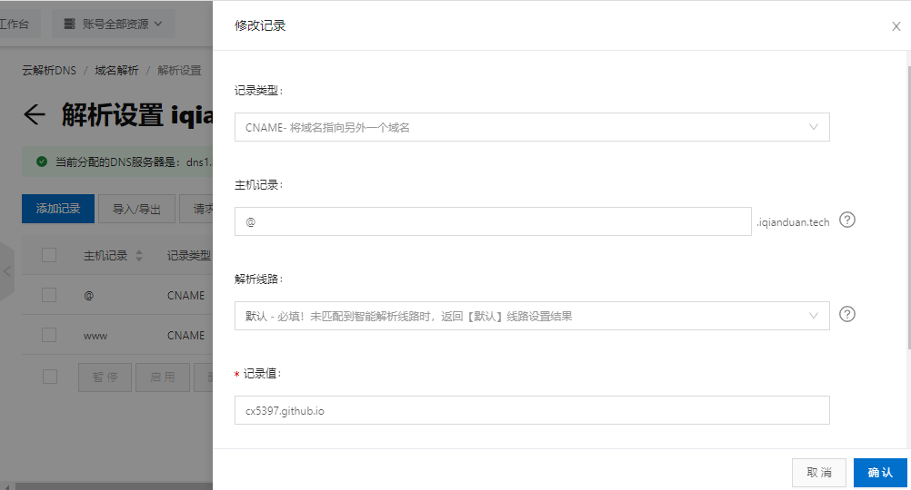
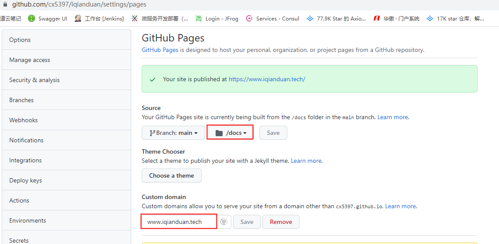

+++
title = "使用hugo搭建博客"
description = "Hugo is one of the most popular open-source static site generators. With its amazing speed and flexibility, Hugo makes building websites fun again."
date = 2021-12-15T16:37:51+08:00
featured = false
comment = true
toc = true
reward = true
categories = [
  "部署"
]
tags = [
  'hugo',
  'hugo-theme-bootstrap',
  'github page'
]
series = [
  "工具"
]
images = []
+++

The world’s fastest framework for building websites

<!--more-->

## 前言

同事问我，你有什么梦想，我想了半天没有回答出来，思来想去，对于梦想，大多数都跟钱有关，话说没有钱解决不了的问题，解决不了那就是钱不够，那么我们有没有什么东西是很重要，又是钱买不到的，或者不容易买到的呢

健康的身体，话说身体是革命的本钱，是所有的基础，花时间去锻炼身体，健康营养的饮食，良好愉悦的心情，是保持健康的最低条件

一技之长，人生的价值在于被利用价值，人不可能做好很多事，于是根据自己能力选择合适的事就很重要，做一行爱一行，拥有难以替代的特长，是生存的保障

对于未来的希望，未来很漫长，需要有期待，有诗，有远方

能够陪伴你的好友，人是群体动物，社会关系构筑了现代文明体系，每个人都很忙，在快节奏的城市，能够有交集那也是难得的缘分

2022 决定好好写博客，促使自己学习，变的更好(这也是建站目的)

## 域名申请

域名我使用的阿里云的[万网](https://wanwang.aliyun.com/domain/)购买的 10 年期限，199 人民币，也可以不买域名，买域名只是让网站地址更加好记忆，看起来高大上一点，免费静态托管网站提供的地址太长不友好

域名买下来后需要在购买商那里完成实名信息登记

## ipc 备案与免费静态服务器

根据国家规定，国内的网站都需要备案，备案就是企业或个人提交建站相关信息到对应服务商，用于国家监管，服务器在国外就不需要备案

找到的免费的静态托管网站有 gitee 和 github，gitee 在国内需要备案，不提供个性化域名服务(收费版本可以)，但是访问速度会快于 github，为了使用个性化域名，所以我选择了 github

## hugo 工程创建与编译

1. 下载 [hugo 软件](https://github.com/gohugoio/hugo/releases)生成网站
2. 将解压的可执行文件路径 bin 目录加入环境变量 path
3. 新开 cmd 命令窗口，创建工程

```
hugo new site myblog
cd myblog
新建目录themes
```

4. 将[hugo-theme-bootstrap](https://github.com/cx5397/hugo-theme-bootstrap)下载下来放在 themes 目录下
5. 在 myblog 工程根目录下执行下列命令

```
cp -a themes/hugo-theme-bootstrap/exampleSite/* .
//如果你使用的是 Windows，请改用 xcopy .\themes\hugo-theme-bootstrap\exampleSite /E
```

6. 运行工程 `hugo server --watch`
7. 编译文件到 docs 目录下 `hugo -d docs`
8. 将整个工程提交到 github 仓库中

## 域名解析与 github page 设置

1. 在域名服务商将域名 CNAME 到 github 服务器，格式为 github 用户名.github.io（@记录为不带 www 的域名解析）
   
2. 点开刚刚提交到的 github 仓库，进入 settings 目录
3. 找到 GitHub Pages,点击 Check it out here
4. 填写代码所在分支，选择/docs 目录，点保存，Custom domain 填写自己刚刚解析的域名地址，点保存
   
