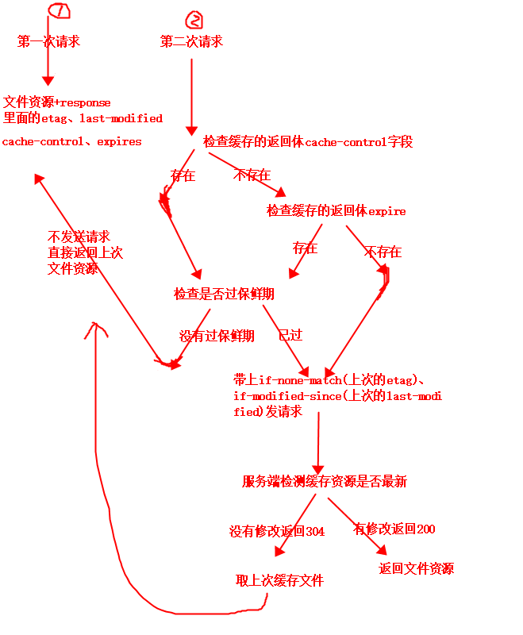

+++
title = "浏览器缓存过程"
description = "cache-control、expires、last-modified、etag"
date = 2022-07-21T14:10:51+08:00
featured = false
comment = true
toc = true
reward = true
categories = [
  "前端"
]
tags = [
  'cache'
]
series = [
  "部署"
]
images = []
+++

<!--more-->

#### 过程图解

#### 1.缓存过程

- 如果本地有相关资源的缓存，并且在缓存的时候响应头里面有 etag 或者 last-modified 的情况，这个时候去请求服务器的时候就会是带有条件的 GET 请求(Conditional Validation)。
- 在请求头里面可能会有两个字段： if-none-match、 if-modified-since，其中 if-none-match 的值是服务器上次返回该资源时响应头里面 etag 的值，if-modified-since 的值是服务器上次返回该资源时响应头里面 last-modified 里的值。
- 紧接着服务器端就会接收到这个带有条件的 request，然后会根据这两个值去判断缓存的资源是否是最新的。
- 如果没问题，即资源是最新的情况下就会返回 304，body 为空；不是的话就会返回 200，即目前浏览器端的资源不是最新的，body 里面就是资源体，然后客户端就会用最新返回的资源覆盖掉之前的资源
- 也就是说。发送这种带条件的请求的必要条件是 资源在浏览器端有缓存，并且在缓存的时候服务器端的 reponse 里面有 etag 或者 last-modified。如果这个条件不满足，发送的请求就是没有条件的(unconditionally)。
- 此方法弊端：虽然说通过这种方式能够减轻服务器的压力，解决一些请求资源时的性能问题。但是细细看来，还是存在一些浪费：每个都要去带上条件请求服务器来看资源是不是最新的，大多情况下是最新的情况下岂不是每次都在做无意义的验证？

#### 2.缓存改进

- Cache-control 用于控制 HTTP 缓存（在 HTTP/1.0 中可能部分没实现，仅仅实现了 Pragma: no-cache）；Expires 表示存在时间，允许客户端在这个时间之前不去检查（发请求），等同 max-age 的效果。但是如果同时存在，则被 Cache-Control 的 max-age 覆盖。（题外话：Expires 要求客户端和服务端的时钟严格同步。HTTP1.1 引入 Cache-Control 来克服 Expires 头的限制。如果 max-age 和 Expires 同时出现，则 max-age 有更高的优先级。）
- 如果上面 Cache-control、Expires 没有到时间，就不会发送请求，直接用缓存文件，如果到了时间，就走第一点流程
