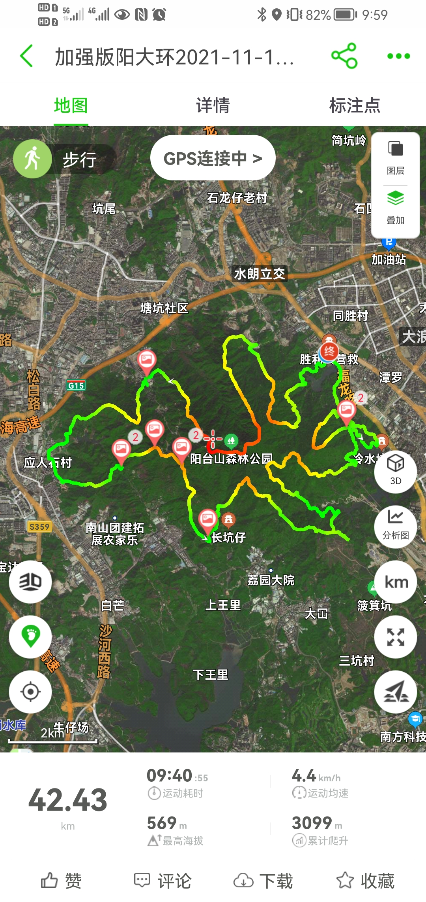
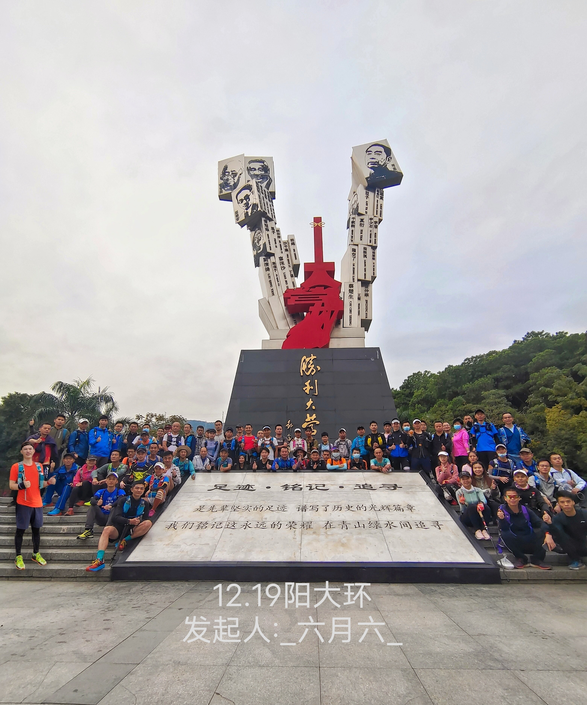
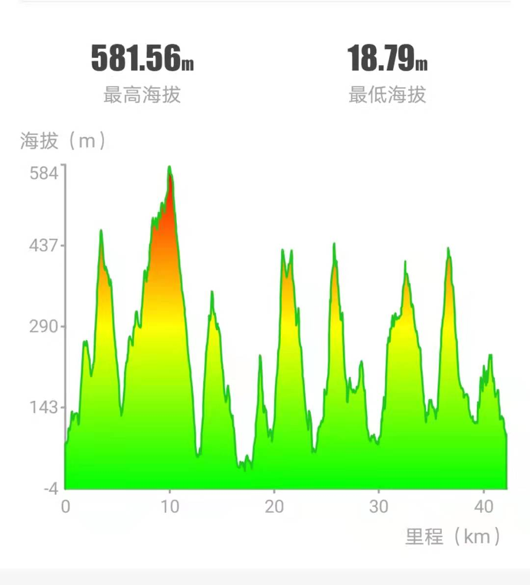
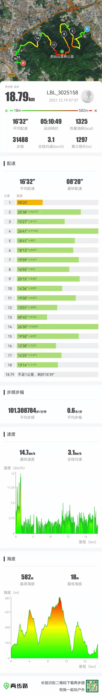
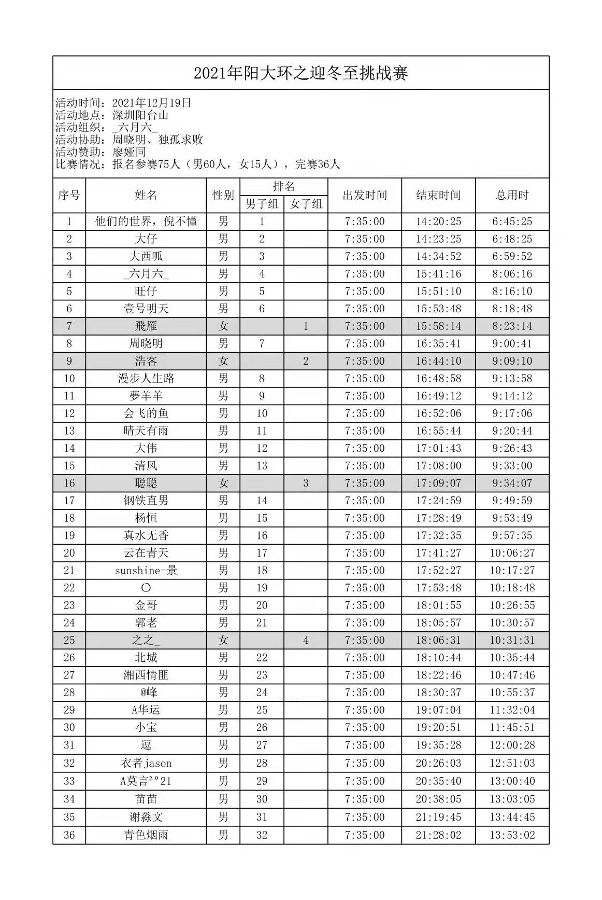

+++
title = "羊台山大环徒步"
description = "羊台山大环难度极大，是一条非常变态的路线"
date = 2021-12-19T16:10:51+08:00
featured = false
comment = true
toc = true
reward = true
categories = [
  "生活"
]
series = [
  "户外"
]
tags = [
  '阳台山'
]

images = []
+++

<!--more-->

2021 年 12 月 19 日在两步路 App，报名参加了阳台山大环户外，全程有 42.43 公里，最高海拔 569 米，累计爬升 3099 米，天生牛犊不怕虎，初生新驴不怕虐，带着减肥的目标报名了

有个热心队友，自掏腰包 1800，设立了爬山的奖金，男女各组 1-3 名奖励 200，男子 4-10 名奖励 100(女生少，只设 3 个奖)，这个热心队友是真的热心，一大早就煮了很多鸡腿带过来给大家吃，出钱又出东西，真的没话说。

6 点半起床，楼下吃完热干面就急匆匆的打车前往阳台山胜利大营救，一到就傻眼了，全都是瘦瘦的肌肉猛男猛女，装备一看就是专业的队伍，听说很多都是户外运动比赛的冠军，7 点 35 爬山开始。

这个爬山路径很变态，八上八下，好不容易爬到山顶又下来，然后又爬到山顶，走完了 8 条上山下山路径，上山路都是选择的最陡的，对身体素质考验很大

一开始跟着队伍跑了一两公里，体力就有点不支了(平常运动太少了)，右腿也有点抽筋了，一瘸一拐的坚持到了应人石，到应人石已经 1 点多了，腿实在受不了，就下撤了，爬了 18 公里多。

完赛的大神成绩汇总单

女大神上坡都是跑的，好厉害

<video  autoplay muted loop playsinline style="width:100%;max-width:500px;">
  <source src="images/pao.mp4" type="video/mp4" />
  Your browser does not support the video tag.
</video>

通过这次户外，认识到了运动需要一步步提升，强来容易带来身体上的伤害，需要先找难度低一点的，等体能提升了再慢慢挑战难一点的运动。
