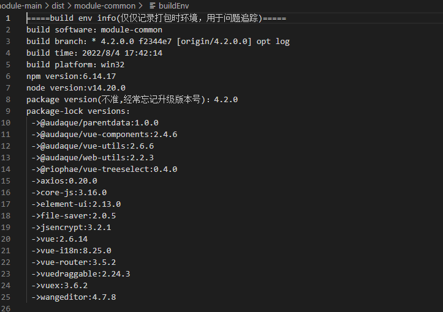

+++
title = "写一个插件收集打包环境信息，放置在打包资源中"
description = "产品发包太多，管理起来很麻烦，线上出了问题，没法快速定位分支与环境"
date = 2022-08-08T13:37:51+08:00
featured = false
comment = true
toc = true
reward = true
categories = [
  "环境"
]
series = [
  "vue打包"
]
tags = [
]

images = []
+++

<!--more-->

## 工具库中记录打包环境信息相关代码

```
const os = require("os");
const util = require("util");
const exec = util.promisify(require("child_process").exec);
const fs = require("fs");
const path = require("path");
const vueConfig = require("../../../../vue.config");
const defaultDir = path.resolve(__dirname, "../../../../"); //使用项目的根目录
// const vueConfig = require("./vue.config");
// const defaultDir = path.resolve(__dirname, "./"); //使用项目的根目录
var MODE_0666 = parseInt("0666", 8);

async function execCommand() {
  const { stdout, stderr } = await exec("git branch -vv");
  const { stdout: n_stdout, stderr: n_stderr } = await exec("npm -v");
  const { stdout: o_stdout, stderr: o_stderr } = await exec("node -v");
  if (stderr || n_stderr || o_stderr) {
    console.log(stderr, n_stderr, o_stderr);
  } else {
    return [
      stdout.split("\n").find((i) => i.startsWith("*")),
      n_stdout,
      o_stdout,
    ];
  }
}

function readFileText(absolutePath) {
  //console.log('   \x1b[36mread file from\x1b[0m : ' + absolutePath.substr(-80));
  return fs.readFileSync(absolutePath, "utf-8").toString();
}

function writeFile(absolutePath, str, mode) {
  fs.writeFileSync(absolutePath, str, { mode: mode || MODE_0666 });
  //console.log('   \x1b[36mwrite file to\x1b[0m : ' + absolutePath.substr(-80));
}

//当前时间
let time = new Date().toLocaleString();

//当前操作系统
let sys = os.platform();

//当前软件名、版本、依赖软件版本
let packageStr = readFileText(path.join(defaultDir, "/package.json")),
  pkg = JSON.parse(packageStr),
  name = pkg.name, //软件名
  version = pkg.version, //当前package.json version
  dependencies = pkg.dependencies,
  packages = Object.keys(dependencies),
  realPackageStr = ""; //

//依赖软件版本信息
let lockStr = readFileText(path.join(defaultDir, "/package-lock.json")),
  lockPkg = JSON.parse(lockStr),
  lockDependencies = lockPkg.dependencies;
for (let i = 0; i < packages.length; i++) {
  realPackageStr +=
    " ->" + packages[i] + ":" + lockDependencies[packages[i]].version + "\n";
}

//当前分支
execCommand().then((res) => {
  if (res) {
    let str =
      `=====build env info(仅仅记录打包时环境，用于问题追踪)=====\nbuild software：${name}\nbuild branch：${res[0]}\nbuild time：` +
      `${time}\nbuild platform：${sys}\nnpm version:${res[1]}node version:${res[2]}package version(不准,经常忘记升级版本号)：${version}\n` +
      `package-lock versions：\n${realPackageStr}`;
    //console.log(str);
    //写到打包后的根目录
    const writeFilePath = path.join(
      defaultDir,
      vueConfig.outputDir,
      "buildEnv"
    );
    console.log(writeFilePath);
    writeFile(writeFilePath, str);
  }
});


```

## 使用

- 发部相关工具
- 安装发布的工具
- package.json,scripts 相关打包命令后+`&& node ./node_modules/@audaque/vue-config/lib/buildEnv`

## 包中 buildEnv 文件输出结果


