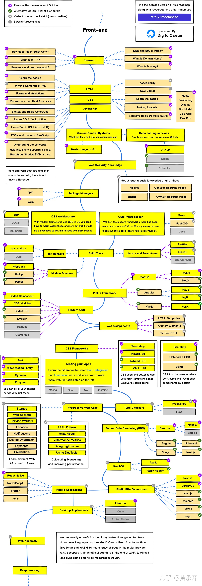

+++
title = "前端知识点"
description = "作为一个前端开发，需要掌握哪些知识呢？"
date = 2021-12-20T20:10:51+08:00
featured = false
comment = true
toc = true
reward = true
categories = [
  "前端"
]
tags = [
  '技能点'
]
series = [
  "规划"
]
images = []
+++

前端开发需要学习的技能点

<!--more-->

前端基础知识学习网站有[w3c](https://www.w3school.com.cn/),[MDN](https://developer.mozilla.org/zh-CN/) ,[freecodecamp](https://chinese.freecodecamp.org/),基础知识看这些就够了，不需要东看看西看看。

经常上github查看前端开源库，是快速提高技能的重要方式

其它相关知识，编程思想、计算机基础、后端知识(前端开发者，想学习一门后端语言，可以学习node,做全栈开发)
